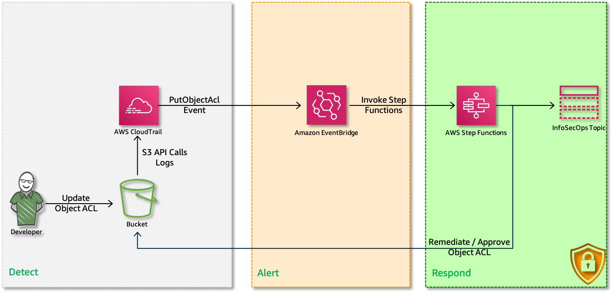
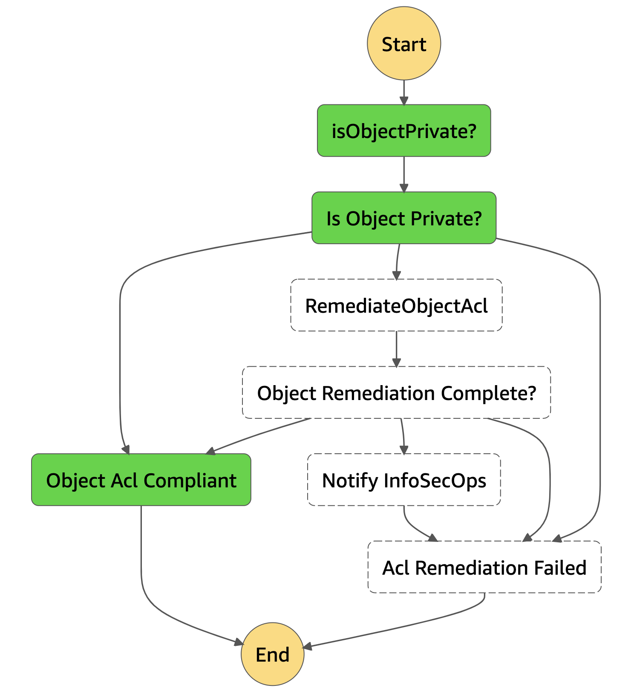
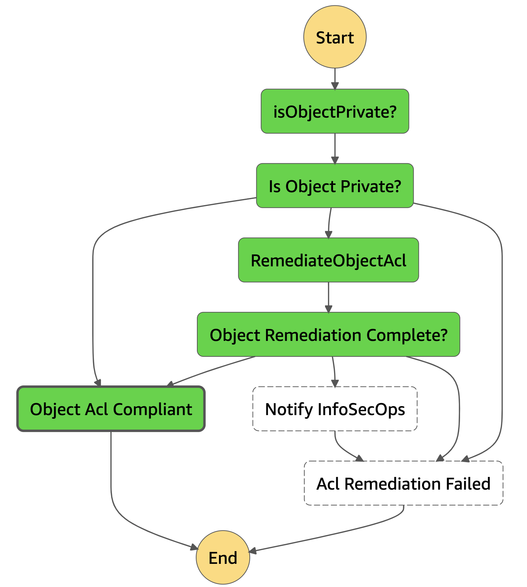
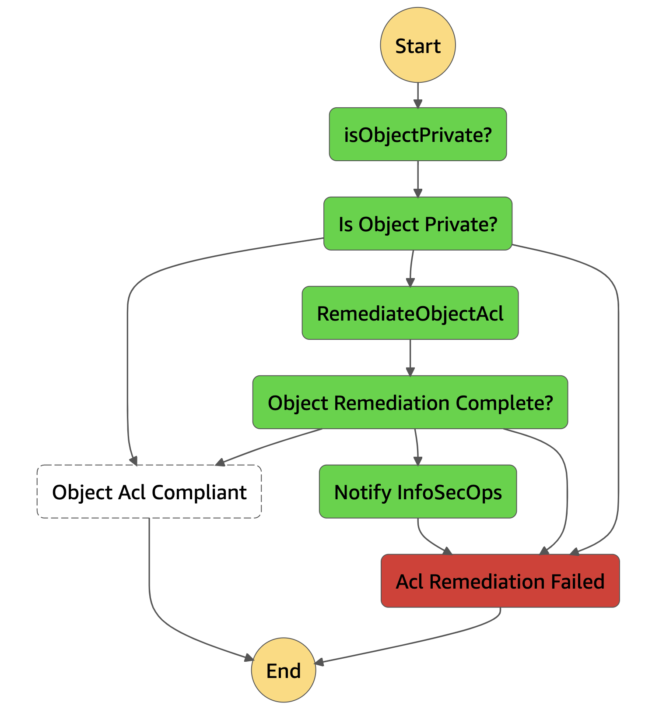

# 👮AWS Security Automation: Remediate Unintended S3 Object ACLs

 S3 Access Control Lists (ACLs) allow you to specify permissions that grant access to S3 buckets and objects. For example, you could set up an ACL for an object so that only the users in your account/bucket owner can access it.

- What if, A user were to call the `PutObjectAcl` API call on an object that is supposed to be private and make it `public-read`?
- What if, A user were to call the `PutObject` with Acl parameter set to `public-read`?

Ever wondered how to keep the objects private? How to solve this problem and do this efficiently at cloud scale?

- What if, You can automatically validate any changes to S3 Object ACLs?
- What if, You can revoke the change change and notify SecOps if it is non compliant?

That is exactly what we are going to do right now using, `AWS CloudTrail`, `AWS EventBridge`, `AWS StepFunctions`.

  

  Follow this article in **[Youtube](https://www.youtube.com/c/ValaxyTechnologies)**

  For every `PutObjectAcl` & `PutObject` event, we will check if the `Grants` is same as object owner. If it is the case, we approve this ACL, If not we revoke it. This is a reactive(aka _NIST Respond_) solution, If you are looking for _proactive_ solutions, you should use a combination of bucket and IAM policies.

1. ## Prerequisites

    This demo, instructions, scripts and cloudformation template is designed to be run in `us-east-1`. With few modifications you can try it out in other regions as well(_Not covered here_).

    - AWS CLI pre-configured - [Get help here](https://youtu.be/TPyyfmQte0U)
    - **Optional** AWS CDK Installed & Configured - [Get help here](https://www.youtube.com/watch?v=MKwxpszw0Rc)

1. ## Solution Overview

    In this repo, I have included a cloudformation template that provisions the resources to setup a fully automatic policy remedation engine.

    - **S3 Bucket**: We will use this bucket to modify its policy
    - **Cloudtrail(regional)**: Monitor all S3 API Events
    - **StepFunction**:
        - Evaluate new object acl
        - If `NON COMPLIANT` trigger remediation
        - If remediation fails, notify InfoSecOps
    - **EventBridge Rule**: Receives `PutObjectAcl` or `PutObject` events & triggers stepfuction
    - **IAM Roles**: For lambda and step functions with restrictive permissions

    _**Note**: Sample commands to modify acl to test the solution can be found in the output section of the cloudformation template_

1. ## Deployment

    You have couple of options to set this up in your account, You can use [AWS CDK](https://www.youtube.com/watch?v=MKwxpszw0Rc) or use the cloudformation template generated by CDK. All the necessary steps are baked into the templates, you can launch it and try it out.

  1. ### Method 1: Using AWS CDK

      If you have AWS CDK installed you can close this repository and deploy the stack with,

        ```sh
        # If you DONT have cdk installed
        npm install -g aws-cdk

        git clone https://github.com/miztiik/security-automation-remediate-unintended-s3-object-acl.git
        cd security-automation-remediate-unintended-s3-object-acl
        source .env/bin/activate
        pip install -r requirements.txt
        ```

      The very first time you deploy an AWS CDK app into an environment _(account/region)_, you’ll need to install a `bootstrap stack`, Otherwise just go ahead and deploy using `cdk deploy`

        ```sh
        cdk bootstrap
        cdk deploy
        ```

  1. ### Method 2: Using AWS CloudFormation

      Look for the cloudformation template here: `cdk.out` directory, _From the CLI,_

        ```sh
        aws cloudformation deploy \
            --template-file ./cdk.out/security-automation-remediate-unintended-s3-object-acl.template.json \
            --stack-name "MiztiikAutomationStack" \
            --capabilities CAPABILITY_IAM
        ```

1. ## Testing the solution

    Let us upload some objects to our monitored bucket and check the step function for each scenario. In the `Outputs` section of the cloudformation template you have the following information, `MonitoredS3Bucket`- Upload any object to the this bucket,

    1. Upload object with `Private` Acl.
    
    1. Change the ACL of the object using _AWS CLI_(command can be found in the outputs) or GUI
        - Check the status of the ACL, to see if the `public-read` persists?
    You should be able to see something like this for a successful remediation.
    
    1. Remediation Failure: If for any reason, we are unable to remediate the acl, the step-function will trigger failure and notify `InfoSecOps` Email.


    

    **NOTE**: Be careful not to set off an infinite step function loop. Every lambda remediation with for modifying acl will trigger `PutObjectAcl` event. Be careful, when you are customzing it :).

    _If you happen to set off infinite loop, one easy way to break the loop is to `DISABLE` the event rule or stop the state machine `Execution`, until you fix your non compliances._

    Now that we have confirmed the solution is working, you can extend the solution as required.

1. ## Next Steps: Do Try This

    - Qurantine User/Role triggering multiple failures
    - Try to batch requets?
    - Monitor against infinite loops

1. ## Additional Comments

    As mentioned earlier, this is a reactive solution. This automation should not be the primary means of defence against weak policies. You should consider,

    - Who has permissions to change bucket permissions? Setup proper Bucket/IAM Policies
    - Are those permissions restricted only the resources they own? - Refer [Attribute Based Access Control - ABAC](https://github.com/miztiik/dev-sec-ops/tree/master/s3-restrict-object-access-based-on-tags-abac)
    - Are you auditing those privileges automatically?
    - If all else fails, do you have mechanisms that will automatically respond to events?

1. ## CleanUp

    If you want to destroy all the resources created by the stack, Execute the below command to delete the stack, or _you can delete the stack from console as well_

    1. Delete CloudTrail S3 Buckets/Objects - as required,
        - The bucket names begin with:  `security-automation-remed*`
    1. Delete CloudWatch Lambda LogGroups
    1. Delete the stack[s],

    ```bash
    # Delete the CF Stack
    aws cloudformation delete-stack \
        --stack-name "MiztiikAutomationStack" \
        --region "${AWS_REGION}"
    ```

    This is not an exhaustive list, please carry out other necessary steps as maybe applicable to your needs.

## Buy me a coffee

Buy me a coffee ☕ through [Paypal](https://paypal.me/valaxy), _or_ You can reach out to get more details through [here](https://youtube.com/c/valaxytechnologies/about).

### References

1. [Controlling Access to S3 Resources](https://aws.amazon.com/blogs/security/iam-policies-and-bucket-policies-and-acls-oh-my-controlling-access-to-s3-resources/)
1. [Bucket Policy Examples](https://docs.aws.amazon.com/AmazonS3/latest/dev//example-bucket-policies.html)
1. [Configure a CloudWatch events rule for GuardDuty](https://aws.amazon.com/premiumsupport/knowledge-center/guardduty-cloudwatch-sns-rule/)

### Metadata

**Level**: 400
